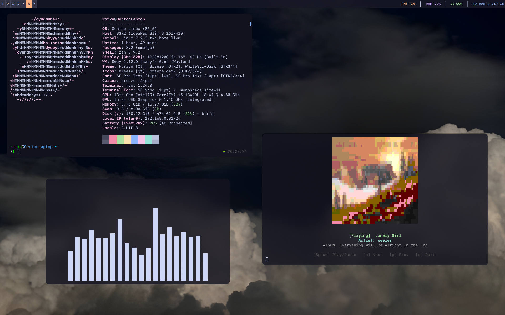

# Gentoo Dotfiles

Minimalist Wayland desktop configuration for Gentoo Linux running SwayFX.



## System Overview

- OS: Gentoo Linux
- Init: OpenRC
- Window Manager: SwayFX (rounded corners, blur effects, shadows disabled)
- Status Bar: Swaybar with custom modular status script
- Terminal: Foot
- Shell: Zsh with Fast-Syntax-Highlighting and Zsh-Autosuggestions
- Editor: Neovim with Lazy.nvim, Treesitter, Mason, and LSP
- Application Launcher: Fuzzel
- Notification Daemon: Mako
- Screen Locker: Swaylock-effects
- Media Viewer: Nowplaying (custom C MPRIS client with Chafa rendering)
- Audio System: PipeWire and WirePlumber with Bit-Perfect Hi-Res configuration
- Fonts: SF Pro Text, SF Pro Display, SF Mono

## Keybindings

- Super + Return: Launch terminal (Foot)
- Super + D: Application launcher (Fuzzel)
- Super + Shift + Q: Close focused window
- Super + Shift + E: Exit Sway
- Super + Shift + C: Reload Sway configuration
- Super + L: Lock screen (Swaylock-effects)
- Super + 1-9: Switch workspace
- Super + Shift + 1-9: Move focused window to workspace
- Print: Screenshot area to clipboard and file (Grim + Slurp)
- Shift + Print: Full screen screenshot
- Volume Keys: Control volume with on-screen notification
- Brightness Keys: Control display backlight with on-screen notification

## Repository Structure

- `.config/sway/`: SwayFX window manager configuration and status bar script
- `.config/foot/`: Foot terminal configuration
- `.config/fuzzel/`: Fuzzel launcher configuration
- `.config/mako/`: Mako notification daemon configuration
- `.config/nvim/`: Neovim configuration and plugins
- `.config/pipewire/`: Bit-perfect PipeWire audio configuration
- `.config/wireplumber/`: WirePlumber configuration
- `.local/bin/`: System utilities (audio/backlight OSD, screen locking, nowplaying)
- `.local/src/nowplaying/`: C source code for the terminal media display tool
- `.zshrc`, `.zprofile`: Zsh configuration files
- `etc/portage/make.conf`: Optimized Gentoo compilation flags
- `install.sh`: Automated installation script

## Installation

Clone the repository and run the installation script:

```bash
git clone https://github.com/qvkap/Gentoo-Dotfiles.git
cd Gentoo-Dotfiles
chmod +x install.sh
./install.sh
```

Alternatively, copy the files manually:

```bash
cp -r .config .local .zshrc .zprofile .gtkrc-2.0 Pictures ~
gcc -O2 .local/src/nowplaying/main.c $(pkg-config --cflags --libs gio-2.0) -o ~/.local/bin/nowplaying
```
